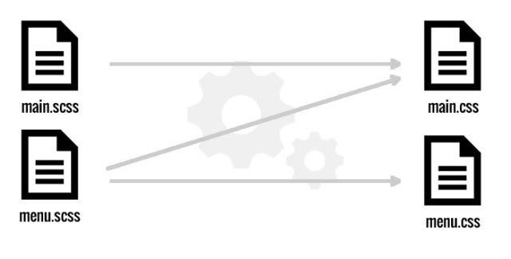
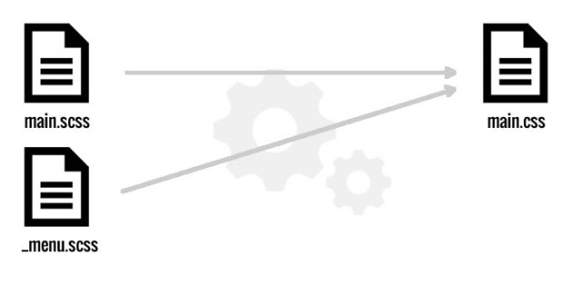

# SASS


## Agenda
1. What is SASS
1. How to Use


是一种 CSS 预处理器

是 CSS 语言的扩展


类似的还有：
* LESS
* Stylus


CSS 不是编程语言

SASS 为 CSS 加入编程元素
* 计算
* 变量
* 函数
* 条件
* 循环
* 继承


SASS or SCSS ?

Sassy(漂亮) CSS

Note: Since 3.0


## 使用


### Import


* main.scss
* menu.scss

```scss
import 'menu'
```



* main.scss
* \_menu.scss

```scss
import 'menu'
```



### 变量


## 参考
* [SASS Guide](http://sass-lang.com/guide)
* [SASS用法指南](http://www.ruanyifeng.com/blog/2012/06/sass.html)
